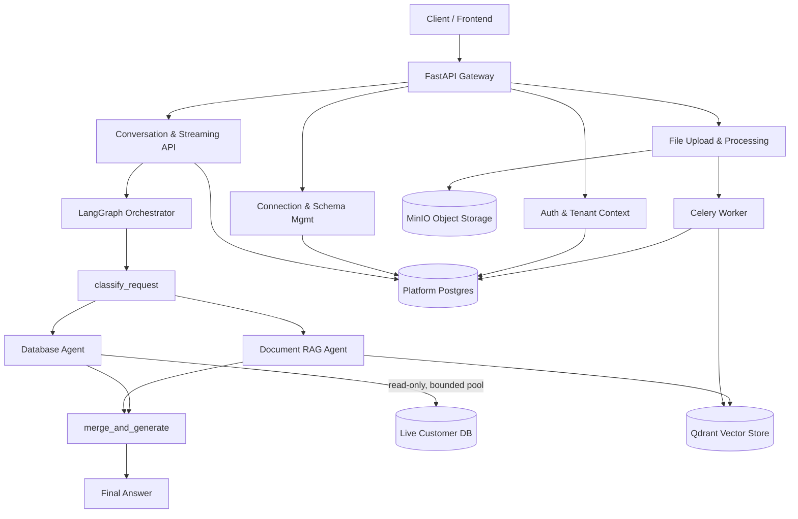
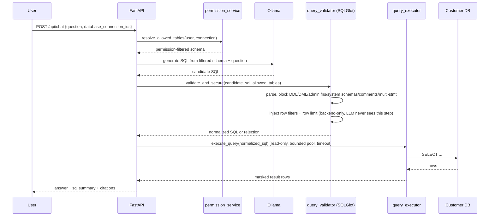
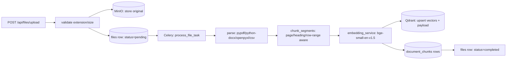
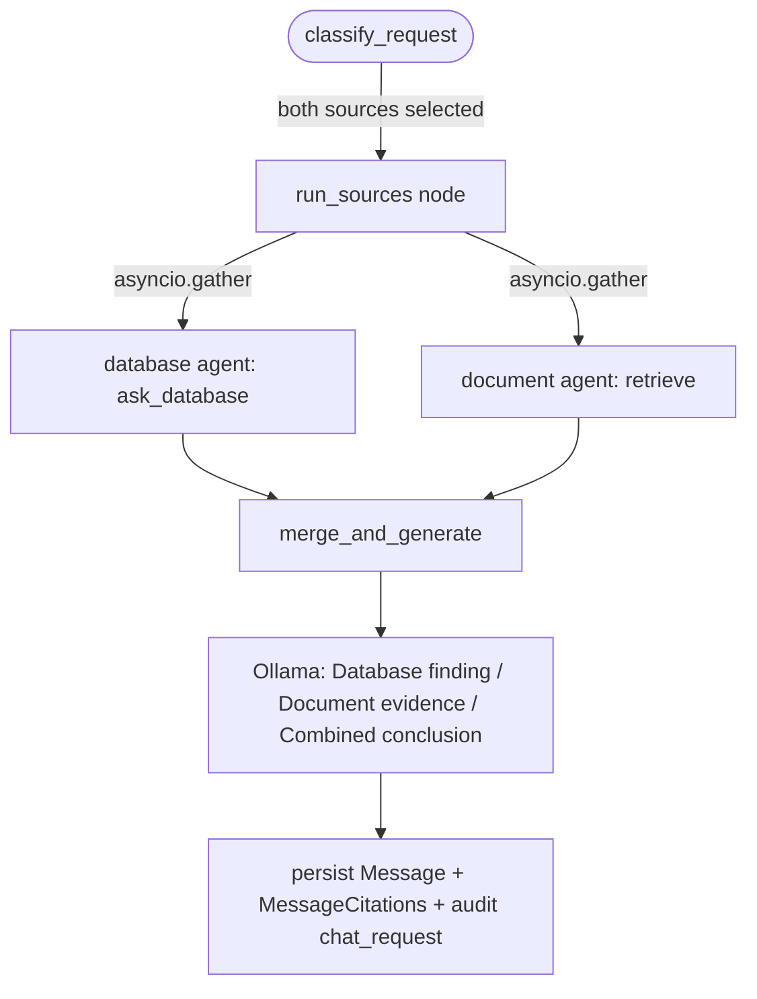
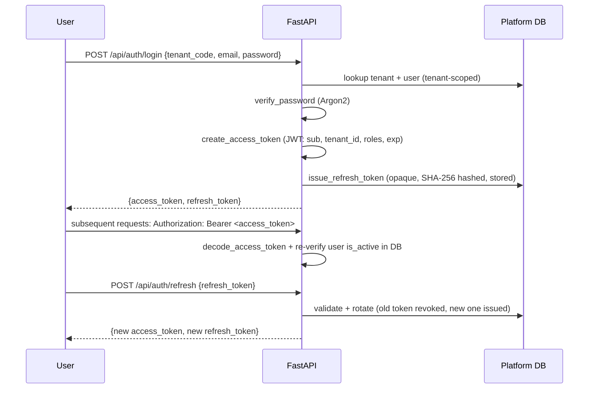
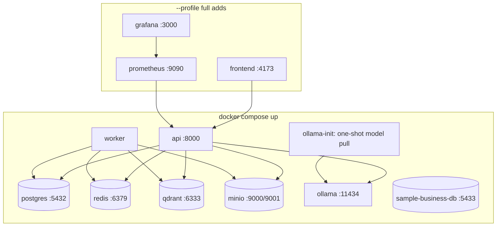
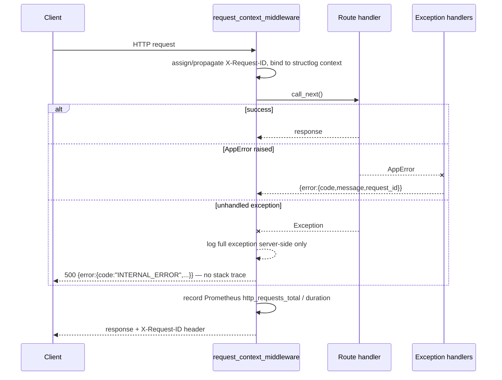

# Architecture

## Overview

The platform database (Postgres) stores identities, permissions, connection metadata, schema
cache, files, conversations, and audit records. **Customer business data never leaves the customer
database** — it is queried live, read-only, through a validated pipeline, and only small result
previews are cached in `query_executions.result_preview` for traceability.

## Text-to-SQL flow

The LLM only ever sees a **permission-filtered schema** (table/column names it's allowed to use)
and never the raw SQL security rules — it cannot see, bypass, or alter the row-filter/limit
injection step, which happens entirely in `query_validator.py` after generation.

## Document ingestion flow

## Hybrid chat flow

Database and document retrieval run **concurrently** (`asyncio.gather`) for hybrid requests. The
document agent's embedding call is offloaded via `asyncio.to_thread` so it never blocks the event
loop the concurrent Ollama HTTP call needs — a real bug found and fixed during live testing (see
`IMPLEMENTATION_PLAN.md` §8).

## Authentication flow

## Docker services

## Request lifecycle

## Modular layout

`app/api` (routes) → `app/services` (business logic, the "real" code) → `app/repositories`
(tenant-scoped data access) → `app/models` (SQLAlchemy ORM) → Postgres/Qdrant/MinIO/Ollama.
`app/agents` holds the LangGraph orchestration layer, which calls the *same* service functions
the REST routes call directly (`text_to_sql_service.ask_database`,
`retrieval_service.retrieve`) — there is no duplicated business logic between the synchronous
API surface and the graph.
