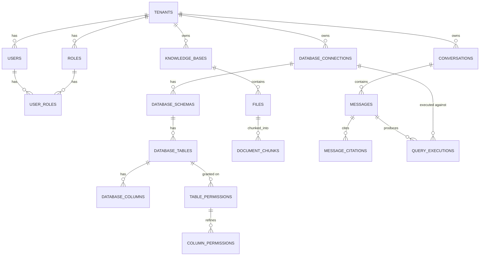

# Database

## Platform database vs. customer databases

The **platform database** (Postgres, this project's own schema below) never stores customer
business rows. It stores:

- Identity/tenancy: `tenants`, `users`, `roles`, `user_roles`, `refresh_tokens`
- Connection metadata (encrypted credentials, never decrypted values): `database_connections`
- Cached schema metadata only (no row data): `database_schemas`, `database_tables`,
  `database_columns`
- Permissions: `table_permissions`, `column_permissions`
- Document pipeline metadata + chunk text (embeddings live in Qdrant, not here):
  `knowledge_bases`, `files`, `document_chunks`
- Conversation state: `conversations`, `messages`, `message_citations`
- Traceability: `query_executions`, `audit_logs`

**Customer databases** (Postgres/MySQL/SQL Server, connected at runtime) are queried live,
read-only, through a bounded connection pool per request — never replicated into the platform DB.

## Entity-relationship overview



## Notable deviations from the PDF's reference schema

Students were told the reference schema is a starting point ("may extend it, but the core
entities and controls must remain"). Two deliberate deviations, both documented at the point of
definition in the model file itself:

1. **`document_chunks.embedding` is not a `VECTOR(1024)` column.** Embeddings live in Qdrant
   instead, keyed by the same UUID as the `document_chunks.id` row. This matches the PDF's own
   "Final Architecture Principle" section, which lists the Vector Database as a separate component
   from the Application Database — storing the vector in both places would just be duplication.
   All other `document_chunks` fields (chunk_index, page_number, section_title, metadata,
   checksum) are unchanged.
2. **`query_executions.conversation_id` / `.message_id`** are real foreign keys (added once
   `conversations`/`messages` existed, in the Phase 6 migration) rather than being introduced with
   a `VECTOR`-style placeholder — this only affects migration ordering, not the final schema shape.

## Migrations

One Alembic migration per phase, in `backend/migrations/versions/`, applied in order:

| Revision | Phase | Adds |
|---|---|---|
| `c7a9e5a73d90` | 2 | tenants, users, roles, user_roles, refresh_tokens, audit_logs |
| `8d30e5156554` | 3 | database_connections, database_schemas, database_tables, database_columns |
| `abd12906673b` | 4 | table_permissions, column_permissions, query_executions |
| `d2a41585ed15` | 5 | knowledge_bases, files, document_chunks |
| `fb882aa4163e` | 6 | conversations, messages, message_citations, query_executions FKs |

Run `alembic upgrade head` (automatic on `api` container startup) or manually:

```bash
docker compose exec api alembic upgrade head
docker compose exec api alembic history
```

Verified to apply cleanly to a genuinely empty Postgres database (a throwaway container was used
mid-project to catch and fix a schema-drift issue — see `IMPLEMENTATION_PLAN.md` §8 for the story).

## Indexing

Every table with `tenant_id`, `user_id`, `conversation_id`, `connection_id`,
`knowledge_base_id`, or `file_id` indexes that column; `created_at` and frequently-filtered status
columns (`files.processing_status`, `audit_logs.created_at`) are also indexed. Application-level
tenant filtering is mandatory on every repository query regardless (see `docs/SECURITY.md`) —
indexes are a performance concern, not the isolation boundary itself.

## Row-Level Security

Not implemented as defense-in-depth in this project (the PDF calls it optional — "where
practical"). Application-level `tenant_id` filtering, enforced in every repository function and
covered by the cross-tenant security test suite, is the actual isolation boundary. Adding Postgres
RLS policies mirroring those filters would be a reasonable follow-up hardening step.
